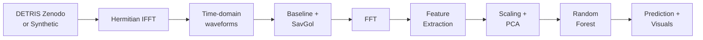

# THz-TDS AI Classification Demo

[](https://github.com/YOUR-USERNAME/thz-tds-ai-classification-demo/actions)
[](https://www.python.org/downloads/)
[](https://opensource.org/licenses/MIT)

**Production-ready**, end-to-end THz-TDS material classification pipeline with interactive Plotly visualisations. Features **DETRIS Zenodo data integration** with synthetic fallback, Hermitian IFFT for frequency→time conversion, and comprehensive testing.

---

## 📋 Release Notes

**Version 2.0.0** — 10 November 2025  
**Commit:** [TBD]  
- **Major enhancements:**
- 🔄 DETRIS Zenodo integration with Hermitian IFFT (real data support)
- 🎛️ `USE_DETRIS` flag for easy data source switching
- 📊 PNG export via kaleido (static figures for documentation)
- 🧪 Comprehensive test suite (data, features, model)
- 🔁 CI/CD with GitHub Actions (pip cache, deterministic execution)
- 🎨 Pre-commit hooks (black, ruff, isort)
- 📦 Production-ready CLI (`src/predict.py`)
- 📚 Expanded documentation with pipeline diagram and reproducibility notes

---

## 🚀 Quickstart

```bash
git clone https://github.com/YOUR-USERNAME/thz-tds-ai-classification-demo.git
cd thz-tds-ai-classification-demo

# Option 1: venv
python -m venv .venv && source .venv/bin/activate  # Windows: .venv\Scripts\activate
pip install -r requirements.txt

# Option 2: conda
conda env create -f environment.yml && conda activate thz-tds-ai

# Open notebook
jupyter lab  # or: code . (VS Code)
```

Open `notebooks/THz_TDS_AI_Classification_Demo.ipynb` and run cells top-to-bottom.

---

## 📊 Pipeline Overview



**Steps:**
1. **Data loading**: Download DETRIS frequency-domain spectra or generate synthetic waveforms.
2. **Hermitian IFFT**: Convert frequency-domain (complex) spectra to real time-domain waveforms using conjugate symmetry.
3. **Preprocessing**: Baseline correction (subtract mean of pre-pulse window) + Savitzky-Golay smoothing.
4. **FFT**: Convert preprocessed waveforms to magnitude spectra.
5. **Feature extraction**: Top-5 spectral peaks, mean frequency, variance, bandwidth proxy.
6. **Dimensionality reduction**: StandardScaler + PCA (2D for visualisation).
7. **Classification**: Random Forest (300 trees, balanced class weights).
8. **Visualisation**: Interactive Plotly (HTML) + static PNG exports.

---

## 📂 Project Structure

```
thz-tds-ai-classification-demo/
├── notebooks/
│   └── THz_TDS_AI_Classification_Demo.ipynb   # Main interactive notebook
├── src/
│   ├── data.py          # DETRIS loader + synthetic fallback
│   ├── preprocess.py    # Baseline correction, smoothing, FFT
│   ├── features.py      # Peak detection, spectral moments
│   ├── model.py         # Random Forest training, artifact saving
│   ├── predict.py       # CLI for inference
│   └── visualise.py     # Plotly figure builders
├── tests/
│   ├── test_data_loader.py   # Data loading tests
│   ├── test_features.py      # Feature extraction tests
│   └── test_model.py         # Model training tests
├── artifacts/           # Generated outputs (models, figures, predictions)
├── .github/workflows/
│   └── ci.yaml          # GitHub Actions CI/CD
├── .pre-commit-config.yaml
├── pyproject.toml       # Black, ruff, isort, pytest config
├── requirements.txt
├── environment.yml      # Conda environment
└── README.md
```

---

## 🗂️ Data Sources

### DETRIS Dataset (Primary)

**Zenodo DOI:** [10.5281/zenodo.5079558](https://doi.org/10.5281/zenodo.5079558)  
**Licence:** CC-BY 4.0  
**Description:** Frequency-domain THz transmission/reflection spectra for various materials (PTFE, Al₂O₃, GFRP, etc.). We download a subset (3 materials, 24 files per class by default) and parse two-column `.txt` files containing:
- Column 1: Frequency (THz)
- Column 2+: Complex amplitude (real and imaginary parts, or magnitude)

**Hermitian IFFT Trick:**  
To convert frequency-domain spectra to real-valued time-domain waveforms, we construct a Hermitian symmetric spectrum:
- Positive frequencies: Original data
- Negative frequencies: Complex conjugate of positive frequencies (reversed order, excluding DC and Nyquist)

This ensures the IFFT result is real-valued, as required for physical time-domain signals.

```python
# Example (simplified)
full_spectrum = [DC, pos_freqs..., neg_freqs_conjugate...]
time_signal = np.fft.ifft(full_spectrum).real
```

**Approximate download time:** 1–2 minutes (zip is ~50–100 MB, we parse a subset).

### Synthetic Fallback

If DETRIS download fails (offline, timeout, or `USE_DETRIS=False`), the pipeline generates synthetic THz-like waveforms driven by literature dielectric properties (e.g. D. Grischkowsky *et al.*, Optica **47**(18), 3254–3258, 2010; Mittleman, *Sensing with Terahertz Radiation*, Springer, 2013). For each material class (Polymer, Ceramic, Composite) we:

- derive a propagation delay via Δt = (n − 1)·d / c using the refractive index `n` and 1 mm slab thickness `d`;
- set the Gaussian pulse width from the reported bandwidth;
- apply an absorption tail proportional to the attenuation coefficient α (cm⁻¹);
- attenuate pulse amplitude by exp(−α·d) before adding low-frequency drift and white noise.


The result is a synthetic dataset that mimics realistic temporal positioning and damping behaviour for representative dielectric classes without requiring online access.

---

## 🔄 Swapping Data Sources

### THzDB or Figshare

1. Add a new loader function in `src/data.py`:
   ```python
   def load_thzdb_subset(...):
       # Download and parse THzDB files
       # Return: times, X_time, y_labels, freq_thz, spectra
       ...
   ```

2. Update `safe_load()` to include THzDB option.

3. Modify notebook cell under **§2. Data Loading** to call `load_thzdb_subset()`.

### Custom CSV/NPY Files

Edit `src/data.py`:
- For **time-domain CSV**: Load two columns (time, amplitude), ensure consistent sampling rate.
- For **frequency-domain CSV**: Load frequency (THz) and magnitude, apply Hermitian IFFT if needed.

**Key functions to modify:**
- `load_detris_subset()` → replace with your custom parser
- `safe_load()` → update fallback logic

---

## 🎯 Reproducibility

**All randomness is seeded:**
- `PYTHONHASHSEED=0` (set in CI and notebook)
- `numpy.random.seed(42)`
- `random_state=42` in sklearn models

**Deterministic across runs:**
- Same data order (sorted labels, fixed file selection)
- Same train/test splits
- Same model predictions

**Package versions:**  
Pinned in `requirements.txt`. To freeze exact versions:
```bash
pip freeze > requirements-lock.txt
```

**Approximate run times (MacBook Pro M1):**
- DETRIS download + processing: ~2–3 minutes
- Synthetic fallback: ~10 seconds
- Model training (300 trees): ~5–10 seconds
- Total notebook execution: ~3–4 minutes

---

## 🧪 Testing & CI

### Run Tests Locally

```bash
pip install -r requirements.txt
pytest -v
```

**Test coverage:**
- `test_data_loader.py`: DETRIS online/offline, synthetic generation, shape/NaN checks
- `test_features.py`: Feature extraction, fixed-length vectors, determinism
- `test_model.py`: Training, accuracy >0.7 on synthetic, reproducibility

**DETRIS test skipped if offline:**  
The test suite uses `pytest.mark.skip` for the online DETRIS test. If offline, it falls back to synthetic and tests still pass.

### CI/CD (GitHub Actions)

`.github/workflows/ci.yaml` runs on every push/PR:
1. **Lint**: black, isort, ruff
2. **Test**: pytest
3. **Notebook execution**: papermill (headless)
4. **Artifact upload**: HTML/PNG figures, executed notebook

**Caching:**  
Pip packages cached (keyed on `requirements.txt` hash) to speed up builds.

---

## 🖼️ Visual Outputs

All figures exported to `artifacts/`:

| File | Description |
|------|-------------|
| `time_domain.html` / `.png` | Time-domain waveforms (subset per class) |
| `spectra.html` / `.png` | Frequency-domain magnitude spectra |
| `pca_scatter.html` / `.png` | 2D PCA scatter coloured by class |
| `feature_importances.html` / `.png` | Random Forest feature importance bar chart |
| `THz_TDS_AI_Classification_Demo.html` | Full executed notebook (via papermill) |

**Sample figures:**

### Time-domain Waveforms


### Frequency-domain Spectra


### PCA Scatter


### Feature Importances


---

## 🔮 CLI Prediction Tool

```bash
# Predict from time-domain waveform
python -m src.predict --input path/to/waveform.csv --domain time

# Predict from frequency-domain spectrum
python -m src.predict --input path/to/spectrum.csv --domain freq

# Example output:
# {
#   "predicted_label": "Polymer",
#   "probabilities": {
#     "Ceramic": 0.05,
#     "Composite": 0.15,
#     "Polymer": 0.80
#   }
# }
```

**Input format:**
- **Time-domain CSV**: Two columns (time [s], amplitude [a.u.])
- **Frequency-domain CSV**: Two columns (frequency [THz], magnitude [a.u.])

Output saved to `artifacts/prediction.json`.

---

## 🛠️ Development

### Install Pre-commit Hooks

```bash
pip install pre-commit
pre-commit install
pre-commit run --all-files  # Check all files
```

Hooks run automatically on commit:
- Trailing whitespace removal
- End-of-file fixer
- YAML/JSON validation
- Black (formatting)
- isort (import sorting)
- Ruff (linting)

### Linting

```bash
black src/ tests/
isort src/ tests/
ruff check src/ tests/ --fix
```

---

## 📜 Licence

MIT — see [LICENSE](LICENSE)

---

## 🙏 Acknowledgements

- **DETRIS dataset**: [Zenodo DOI 10.5281/zenodo.5079558](https://doi.org/10.5281/zenodo.5079558) (CC-BY 4.0)
- **Plotly**: Interactive visualisation
- **scikit-learn**: Machine learning pipeline
- **GitHub Actions**: CI/CD automation

---

## 📧 Contact

For questions or contributions, open an issue or submit a pull request.

**Project URL:** [https://github.com/YOUR-USERNAME/thz-tds-ai-classification-demo](https://github.com/YOUR-USERNAME/thz-tds-ai-classification-demo)

